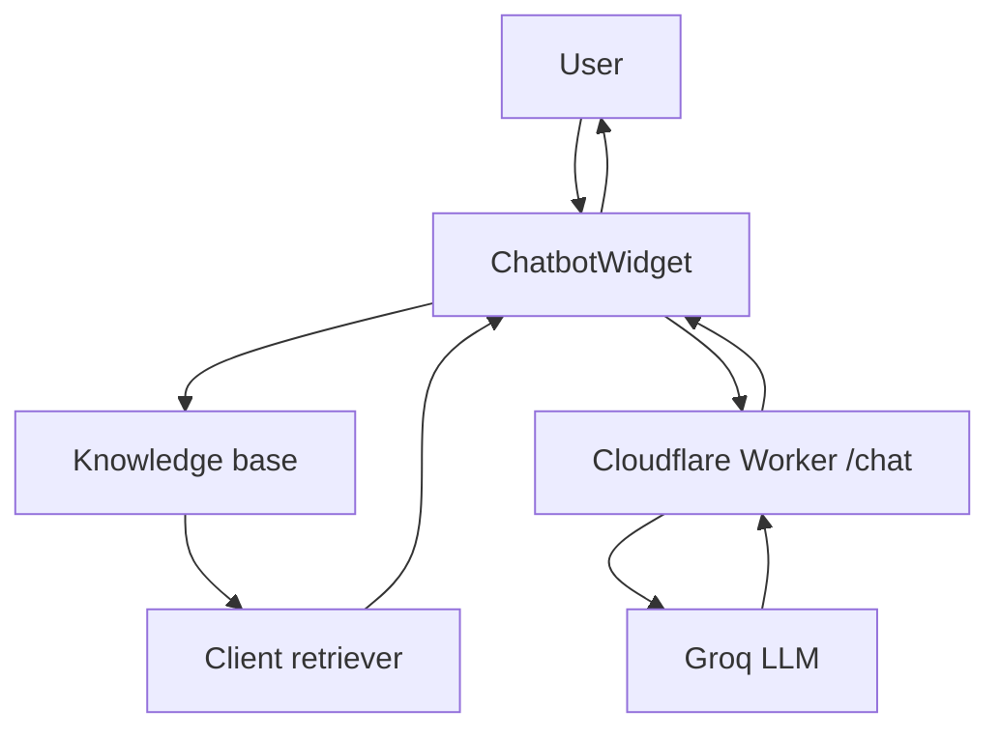

# Vishal Kodam Portfolio

Personal portfolio site built with React, deployed to GitHub Pages. Includes a separate **Writings** section for long-form posts and an on-site chatbot grounded in portfolio content.

**Live site:** [https://vishalkodam.github.io/Portfolio/](https://vishalkodam.github.io/Portfolio/)

## Features

- **Portfolio home** — scroll sections: Home, About, Projects, Contact
- **Writings** — dedicated pages at `/writings` and `/writings/:slug` (same domain, no separate site)
- **Dark mode** — theme toggle with persisted preference
- **Motion** — scroll reveal, progress bar, and astro background (Framer Motion `LazyMotion`)
- **Chatbot** — “Ask about Vishal” widget with client-side retrieval and optional Cloudflare Worker proxy for LLM calls

## Routes

| Path | Page |
|------|------|
| `/` | Portfolio (intro, about, projects, contact) |
| `/writings` | Writings index |
| `/writings/over-engineered-architecture` | Article: *The Wrong Assumption Behind Over-Engineered Architecture* |

Local dev uses the same paths under the `homepage` base: `http://localhost:3000/Portfolio/`.

## Tech stack

- **Frontend:** React 18 (Create React App), React Router
- **Styling:** CSS variables (light/dark), component-scoped CSS
- **Animation:** Framer Motion (`LazyMotion` + `domAnimation`)
- **Contact:** EmailJS
- **Chatbot:** keyword retrieval (`src/chatbot/retrieval.js`) + optional Cloudflare Worker (`workers/chat-proxy`)

## Project structure

```
src/
  App.js                 # Router + routes
  pages/
    HomePage.jsx         # Main portfolio
    WritingsPage.jsx     # Writings list
    WritingArticlePage.jsx
  components/
    Writings/
      writingsData.js    # Post metadata (title, slug, tags, summary)
      Writings.js        # Index UI
      WritingArticle.jsx # Article shell
      articles/          # One component per post
    NavBar/              # Nav (scroll links + NavLink for Writings)
    Chatbot/
    ...
  chatbot/
    knowledge.md         # Source knowledge (sync to knowledgeText.js as needed)
scripts/
  gh-pages-deploy.js     # Deploy helper (ensures Git is on PATH on Windows)
public/
  404.html               # GitHub Pages SPA fallback
```

## Local development

```powershell
cd "C:\Users\visha\Downloads\Portfolio"
npm install
npm start
```

Open [http://localhost:3000/Portfolio/](http://localhost:3000/Portfolio/).

### Chatbot API (optional)

Create `.env` in the repo root:

```env
REACT_APP_CHAT_API_URL=https://<your-worker-subdomain>.workers.dev/chat
```

Restart the dev server after changing `.env`. Without this URL, the chatbot UI still loads but shows a configuration message instead of calling the API.

## Adding a writing

1. Add metadata in `src/components/Writings/writingsData.js` (`slug`, `title`, `subtitle`, `date`, `summary`, `tags`).
2. Create `src/components/Writings/articles/YourArticle.jsx` with the article body.
3. Register the component in `src/components/Writings/WritingArticle.jsx` (`ARTICLE_COMPONENTS`).

The new post appears on `/writings` and at `/writings/<slug>` automatically.

## Chatbot (Cloudflare Worker)

The Worker accepts `POST /chat` with `question` and `context` (assembled by the frontend retriever). It forwards to a hosted LLM using `GROQ_API_KEY` as a Worker secret.

```powershell
npm i -g wrangler
wrangler login
cd workers/chat-proxy
wrangler secret put GROQ_API_KEY --config wrangler.toml
wrangler deploy --config wrangler.toml
```

Set the deployed URL in `.env` as `REACT_APP_CHAT_API_URL` (include `/chat`).

## Deploy

### GitHub Pages (primary)

```powershell
npm run deploy
```

This runs `npm run build` then publishes `build/` to the `gh-pages` branch via `scripts/gh-pages-deploy.js`.

**Note:** `gh-pages` requires Git. If you see `spawn git ENOENT`, install [Git for Windows](https://git-scm.com/download/win) or add `C:\Program Files\Git\cmd` to your system PATH.

### Cloudflare (optional)

```powershell
npm run deploy:site          # static assets from build/
npm run deploy:chat-proxy    # chat API worker
npm run preview              # local wrangler preview after build
```

## Architecture (chatbot)


