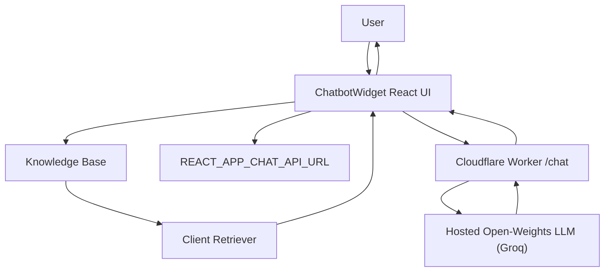

## Vishal Kodam Portfolio

This repository contains a React-based personal portfolio website with a small on-site chatbot that can answer questions about Vishal using a grounded knowledge base (portfolio content).

## Features
- Responsive portfolio sections: `Home`, `About`, `Projects`, `Contact`
- On-site “Ask about Vishal” chatbot widget
- Grounded answers using a local knowledge base (`src/chatbot/knowledge.md`)
- LLM calls are proxied through a Cloudflare Worker (API keys stay server-side)

## Tech Stack
- Frontend: React (Create React App)
- Styling: plain CSS + CSS variables (supports the existing dark mode theme)
- Chatbot:
  - Client-side retrieval: keyword-based chunk selection (`src/chatbot/retrieval.js`)
  - Serverless API proxy: Cloudflare Worker (`workers/chat-proxy`)

## Architecture Diagram


## Local Development

### 1) Install and run the site
```powershell
cd "C:\Users\visha\Downloads\Portfolio"
npm install
npm start
```

The dev server will start on `http://localhost:3000` (or another port if 3000 is already in use).

### 2) Configure the chatbot API URL
Create/update `.env` in the repo root:
```env
REACT_APP_CHAT_API_URL=https://<your-worker-subdomain>.workers.dev/chat
```

Restart the dev server after changing `.env`.

## Chatbot (Cloudflare Worker)

The Worker accepts a `POST` request at `/chat` with:
- `question` (string)
- `context` (string assembled by the frontend retriever)

It forwards the request to a Groq open-weights chat model using `GROQ_API_KEY` stored as a Worker secret.

### Setup steps
1. Install Wrangler (once):
   ```powershell
   npm i -g wrangler
   ```
2. Log in to Cloudflare:
   ```powershell
   wrangler login
   ```
3. Configure the Groq API key as a secret:
   ```powershell
   cd "C:\Users\visha\Downloads\Portfolio\workers\chat-proxy"
   wrangler secret put GROQ_API_KEY --config "wrangler.toml"
   ```
4. Deploy the Worker:
   ```powershell
   wrangler deploy --config "wrangler.toml"
   ```
5. Copy the Worker URL shown by Wrangler and plug it into `.env` as `REACT_APP_CHAT_API_URL` (append `/chat`).

## Deploy to GitHub Pages
```powershell
cd "C:\Users\visha\Downloads\Portfolio"
npm run deploy
```

